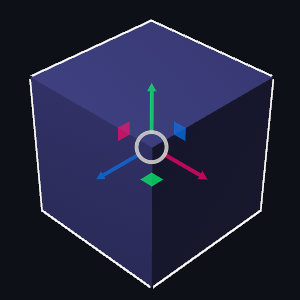

# transform-gizmo

[](https://crates.io/crates/transform-gizmo)
[](https://docs.rs/transform-gizmo)
[](https://github.com/urholaukkarinen/transform-gizmo/blob/main/LICENSE-MIT)
[](https://github.com/urholaukkarinen/transform-gizmo/blob/main/LICENSE-APACHE)

`transform-gizmo` is a framework-agnostic Rust crate that provides an easy-to-use and customizable 3D transformation gizmo for manipulating the position, rotation and scale of 3d entities.

[Try it out in a web demo](https://urholaukkarinen.github.io/transform-gizmo/)





## Usage

### Bevy

`transform-gizmo-bevy` provides a Plugin for easy integration into the Bevy Engine.

See the [minimal Bevy example](crates/transform-gizmo-bevy/examples/bevy.rs).

### Egui

`transform-gizmo-egui` enables you to use the Gizmo wherever Egui is used.

See the [minimal Egui example](crates/transform-gizmo-egui/examples/egui.rs).

### Custom integration

The gizmo provides you with 2D vertices in screen coordinates for each frame that you can use to draw the gizmo.

<details>
  <summary>Basic usage example</summary>
1. Create the Gizmo
    ```rust
    let gizmo_config = GizmoConfig {
        view_matrix,
        projection_matrix,
        model_matrix,
        viewport,
        modes,
        orientation,
        snapping,
        snap_angle,
        snap_distance,
        snap_scale,
        visuals,
        pixels_per_point,
    };

    let mut gizmo = Gizmo::new(gizmo_config);
    ```

2. Interact & draw
    ```rust
    // Update the gizmo configuration if needed.
    // For example, when the gizmo mode is changed.
    gizmo.update_config(new_config);

    // Interact with the gizmo
    let gizmo_result = gizmo.update(GizmoInteraction {
        cursor_pos, // Current cursor position in window coordinates
        drag_started, // Whether dragging was started this frame, e.g. left mouse button was just pressed
        dragging, // Whether the user is currently dragging, e.g. left mouse button is down
    });

    if let Some(result) = gizmo_result {
        // Gizmo was interacted with. Use the result here
    }

    // Get vertex data of the gizmo for this frame.
    let GizmoDrawData {
        vertices,
        colors,
        indices 
    } = gizmo.draw();
    ```
</details>


For a more detailed look on how to integrate the gizmo into your own project, see the existing integrations' sources.

## Other

The gizmo exposes matrices and vectors as [mint](https://github.com/kvark/mint) types, which means it is easy to use with matrix types from various crates
such as [nalgebra](https://github.com/dimforge/nalgebra), [glam](https://github.com/bitshifter/glam-rs)
and [cgmath](https://github.com/rustgd/cgmath). You may need to enable a `mint` feature, depending on the math library.

## License

This crate is dual licensed under MIT and Apache 2.0.

## Contributing

Contributions are welcome! See [CONTRIBUTING.md](CONTRIBUTING.md)